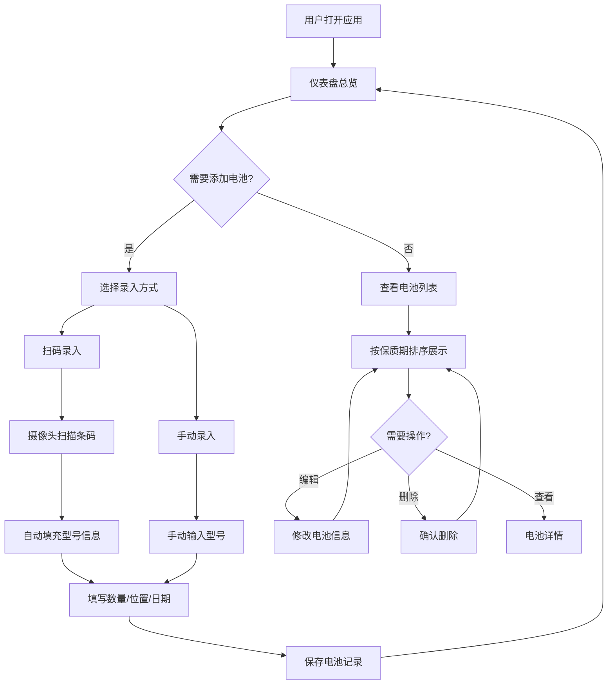

## 1. 产品概述

家用电池管理工具是一款帮助家庭用户管理各类电池的 Web 应用。用户可以录入家中各类电池（5号、7号、纽扣电池、充电电池等），追踪型号、数量、存放位置、购买日期和保质期，避免电池过期浪费或使用过期电池带来的风险。

- 解决问题：家庭电池分散存放、难以追踪保质期、容易遗忘过期电池
- 目标用户：普通家庭用户，注重生活管理的家庭主妇/主夫、DIY爱好者

## 2. 核心功能

### 2.1 用户角色

| 角色 | 注册方式 | 核心权限 |
|------|----------|----------|
| 普通用户 | 无需注册，本地使用 | 录入、查看、编辑、删除电池记录 |

### 2.2 功能模块

1. **仪表盘页面**：电池总览、过期提醒、快捷操作
2. **电池列表页面**：按保质期剩余天数排序展示所有电池，支持筛选和搜索
3. **录入/编辑页面**：手动输入或扫码录入电池信息

### 2.3 页面详情

| 页面名称 | 模块名称 | 功能描述 |
|----------|----------|----------|
| 仪表盘 | 统计卡片 | 显示电池总数、即将过期数、已过期数、各类型占比 |
| 仪表盘 | 过期提醒 | 展示30天内即将过期的电池列表，红色高亮已过期项 |
| 仪表盘 | 快捷操作 | 快速添加电池、扫描录入入口 |
| 电池列表 | 搜索筛选 | 按类型、位置、状态（正常/即将过期/已过期）筛选，关键词搜索 |
| 电池列表 | 电池卡片 | 显示电池型号、类型、数量、位置、保质期进度条、剩余天数 |
| 录入/编辑 | 手动录入 | 填写电池型号、类型、数量、存放位置、购买日期、保质期 |
| 录入/编辑 | 扫码录入 | 调用摄像头扫描电池包装条码/二维码，自动填充型号信息 |
| 录入/编辑 | 智能默认 | 根据电池类型自动设置默认保质期（碱性5-10年、锂电池10年等） |

## 3. 核心流程

**电池录入流程**：用户点击添加 → 选择扫码或手动输入 → 扫码自动填充型号/手动输入型号 → 选择电池类型（自动设置默认保质期）→ 填写数量、位置、购买日期 → 确认保存

**保质期监控流程**：系统启动时计算所有电池剩余天数 → 按剩余天数升序排列 → 剩余≤30天标黄提醒 → 已过期标红警告 → 仪表盘展示提醒列表

## 4. 用户界面设计

### 4.1 设计风格

- **主色调**：深灰/墨黑背景（#1a1a2e）配亮橙色（#ff6b35）作为强调色，象征电池能量
- **辅助色**：暗蓝灰（#16213e）、电光蓝（#0f3460）、警示红（#e74c3c）、提醒黄（#f39c12）
- **按钮风格**：圆角矩形（8px），主按钮填充亮橙色，次按钮边框式
- **字体**：标题使用 DM Sans（粗体有力），正文使用 Noto Sans SC（中文友好）
- **布局风格**：左侧导航栏 + 右侧内容区，卡片式布局
- **图标风格**：线性图标（Lucide），与电池/能量主题一致
- **整体风格**：工业实用风，暗色主题，能量感，精致的渐变和微光效果

### 4.2 页面设计概览

| 页面名称 | 模块名称 | UI元素 |
|----------|----------|--------|
| 仪表盘 | 统计卡片 | 4列网格卡片，每张卡片带图标+数字+标签，微妙渐变背景，hover时发光效果 |
| 仪表盘 | 过期提醒 | 带红色/黄色左边框的列表项，进度条显示保质期剩余比例，脉冲动画提醒 |
| 仪表盘 | 快捷操作 | 圆形浮动按钮，扫描按钮带脉冲动画 |
| 电池列表 | 搜索筛选 | 顶部搜索框+下拉筛选器，胶囊式标签切换 |
| 电池列表 | 电池卡片 | 网格卡片，顶部彩色条表示状态（绿/黄/红），型号大字+小字详情，圆形数量徽标 |
| 录入/编辑 | 表单 | 分段式表单，类型选择用图标卡片，日期选择器，滑块选数量 |
| 录入/编辑 | 扫码区域 | 摄像头取景框+扫描线动画，识别成功绿色闪烁反馈 |

### 4.3 响应式设计

- 桌面优先设计，1280px+最佳体验
- 平板适配：768px-1279px，卡片从4列变2列
- 移动端适配：<768px，单列布局，底部导航替代侧边栏

### 4.4 3D场景

不适用
