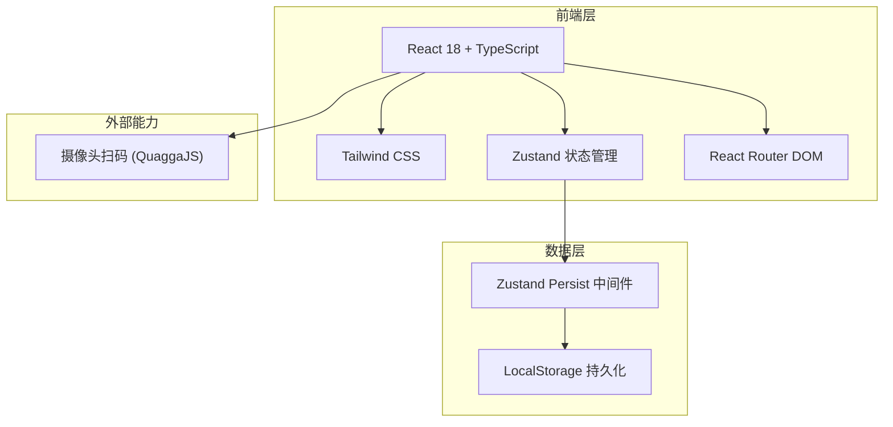
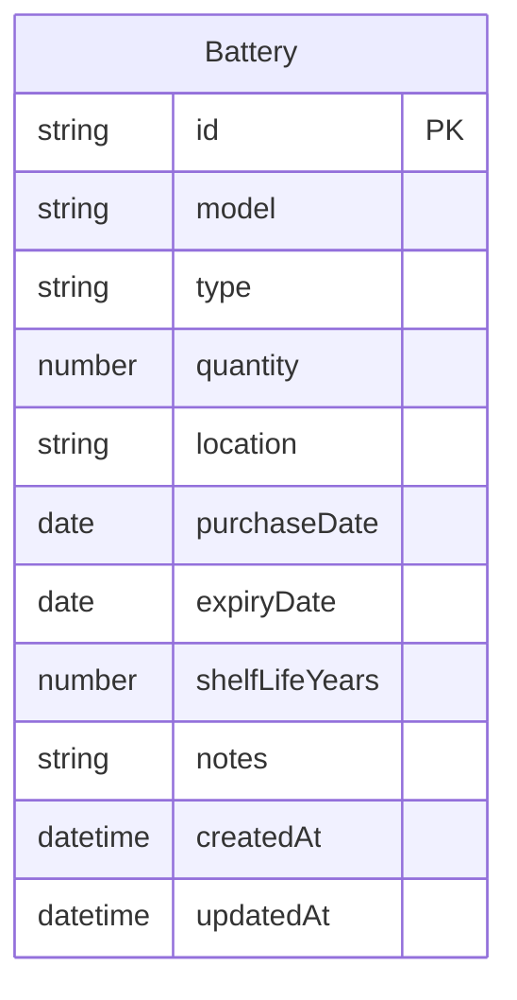

## 1. 架构设计



## 2. 技术说明

- **前端**：React@18 + Tailwind CSS@3 + Vite
- **初始化工具**：vite-init
- **后端**：无（纯前端，数据存储在浏览器 LocalStorage）
- **数据库**：LocalStorage（通过 Zustand Persist 中间件自动序列化）
- **扫码**：QuaggaJS（条码识别库，支持 EAN/Code128 等常见条码格式）
- **状态管理**：Zustand + persist 中间件

## 3. 路由定义

| 路由 | 用途 |
|------|------|
| `/` | 仪表盘页面：电池总览、过期提醒、快捷操作 |
| `/batteries` | 电池列表页面：按保质期排序展示，筛选搜索 |
| `/batteries/add` | 添加电池页面：手动输入/扫码录入 |
| `/batteries/:id` | 电池详情页面：查看和编辑电池信息 |

## 4. API定义

无后端API。所有数据操作通过 Zustand Store 在前端完成。

### 数据操作接口（Zustand Store Actions）

```typescript
interface BatteryStore {
  batteries: Battery[]
  addBattery: (battery: Omit<Battery, 'id' | 'createdAt' | 'updatedAt'>) => void
  updateBattery: (id: string, updates: Partial<Battery>) => void
  deleteBattery: (id: string) => void
  getExpiringBatteries: (days: number) => Battery[]
  getExpiredBatteries: () => Battery[]
}
```

## 5. 服务端架构

不适用（纯前端应用）

## 6. 数据模型

### 6.1 数据模型定义



### 6.2 数据定义

```typescript
interface Battery {
  id: string
  model: string
  type: BatteryType
  quantity: number
  location: string
  purchaseDate: string
  expiryDate: string
  shelfLifeYears: number
  notes: string
  createdAt: string
  updatedAt: string
}

type BatteryType =
  | 'aa'
  | 'aaa'
  | 'button'
  | 'rechargeable_aa'
  | 'rechargeable_aaa'
  | '9v'
  | 'c'
  | 'd'
  | 'lithium'
  | 'other'

interface BatteryTypeInfo {
  type: BatteryType
  label: string
  defaultShelfLifeYears: number
  icon: string
}

const BATTERY_TYPE_INFO: BatteryTypeInfo[] = [
  { type: 'aa', label: '5号电池(AA)', defaultShelfLifeYears: 7, icon: '🔋' },
  { type: 'aaa', label: '7号电池(AAA)', defaultShelfLifeYears: 7, icon: '🔋' },
  { type: 'button', label: '纽扣电池', defaultShelfLifeYears: 5, icon: '⏱️' },
  { type: 'rechargeable_aa', label: '5号充电电池', defaultShelfLifeYears: 5, icon: '♻️' },
  { type: 'rechargeable_aaa', label: '7号充电电池', defaultShelfLifeYears: 5, icon: '♻️' },
  { type: '9v', label: '9V电池', defaultShelfLifeYears: 5, icon: '⚡' },
  { type: 'c', label: 'C型电池', defaultShelfLifeYears: 7, icon: '🔋' },
  { type: 'd', label: 'D型电池', defaultShelfLifeYears: 7, icon: '🔋' },
  { type: 'lithium', label: '锂电池', defaultShelfLifeYears: 10, icon: '⚡' },
  { type: 'other', label: '其他', defaultShelfLifeYears: 5, icon: '📦' },
]
```

### 6.3 计算字段

```typescript
function getRemainingDays(expiryDate: string): number {
  const now = new Date()
  const expiry = new Date(expiryDate)
  return Math.ceil((expiry.getTime() - now.getTime()) / (1000 * 60 * 60 * 24))
}

function getBatteryStatus(remainingDays: number): 'expired' | 'expiring' | 'normal' {
  if (remainingDays <= 0) return 'expired'
  if (remainingDays <= 30) return 'expiring'
  return 'normal'
}
```
